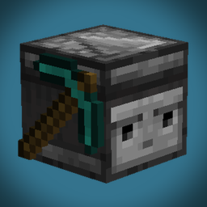

# TurtleCraft

This Minecraft data pack adds turtles that can be programmed to automate tasks, inspired by the "ComputerCraft" mod. With a simplified and user-friendly approach to turtle programming, this data pack can be enjoyed by everyone. It can be used on servers and includes features designed for multiplayer interactions.

The optimization goal was to support multiple turtles running at once on a small server. For larger scales, the data pack includes performance options that can be adjusted in-game to limit potential lag caused by the turtles.

Please note that this is an ongoing project that will be improved over time. If you come across any bugs or issues, please contact me via [Discord](https://discord.gg/QAtc7ZgPxS). You can also use this server to share programs or just chat!

  

## Download
- [Releases Page](https://github.com/Ivaynn/TurtleCraft/releases)
- [Planet Minecraft](https://www.planetminecraft.com/data-pack/turtlecraft-programmable-turtles/)

## More information
- [Wiki](https://github.com/Ivaynn/TurtleCraft/wiki)
- [Introduction video](https://youtu.be/b-ld-X8mnps)

## Features

- Turtles that can be programmed to automate tasks
- Support for multiple turtles working together
- In-game program editor using chat menus
- Basic instructions for mining, farming, building, etc.
- Advanced instructions for conditions, loops and variables
- Ability to import programs from outside of the game
- An inventory system, allowing turtles to interact with items and blocks
- Support for equipped tools, allowing turtles to use them in their tasks
- Customization options for the turtle's appearance and behavior
- Performance options to optimize the data pack for your use
- A comprehensive [wiki](https://github.com/Ivaynn/TurtleCraft/wiki) with examples and tutorials
- Made for Java Edition, starting on 1.19.4 (singleplayer and multiplayer)

# Compatibility Notes

- Java Edition 1.19.4 -> [TurtleCraft 1.0](https://github.com/Ivaynn/TurtleCraft/releases/tag/v1.0)
- Java Edition 1.20 -> [TurtleCraft 1.0.1](https://github.com/Ivaynn/TurtleCraft/releases/tag/v1.0.1)
- Data pack not available for older versions
- Every scoreboard objective, tag and data storage uses the `tc` prefix
- Blocks at `10028 0 10028` and `10028 1 10028` in every vanilla dimension are replaced with bedrock when the data pack needs to use them. These chunks are force loaded
- Some parts of this data pack need to be updated for every new Minecraft version, making it incompatible until a new version of the data pack is released

# License

MIT license, see the [LICENSE](LICENSE) file for details.
